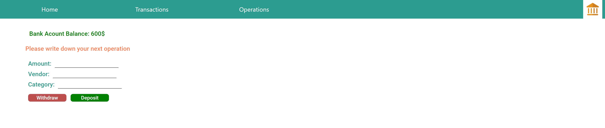

# My first full-stack app: Napoleon-Bank

Tracking expenses and incomes in our bank account.

Technologies: React, react-google-charts Node.js, express, axios, MongoDB, Mongoose, HTML, CSS.

## Home Page

On the home page you can see all the expenses and incomes by categories in pie charts

## Transactions Page

On this page you can see all our expenses and income.
In addition you can delete transactions, the list of transactions and the balance will be updated immediately.

## Operations Page

On this page we can update a new expense we made or a new income we received,
We can determine the vendor and category.

